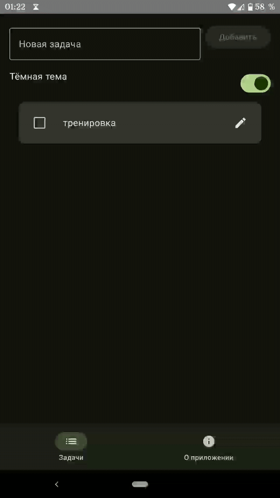
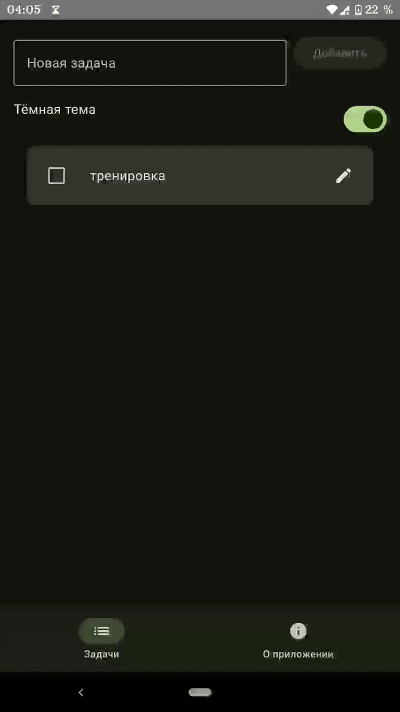
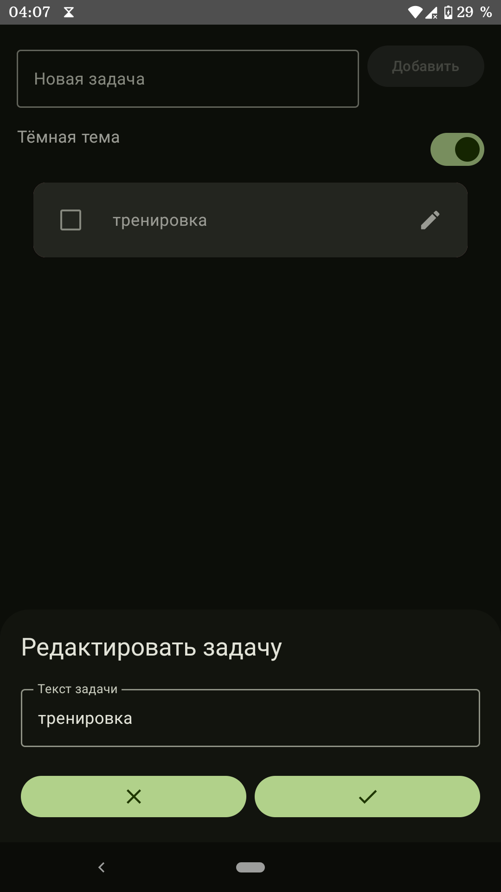

# 🚀 TodoApp: Менеджер задач на современном Android-стеке

Проект демонстрирует навыки разработки на актуальном стеке **Jetpack Compose** с архитектурой **Unidirectional Data Flow (UDF)**.

---

## ✨ Возможности и Демонстрация

    &nbsp;&nbsp;&nbsp;&nbsp;
    &nbsp;&nbsp;&nbsp;&nbsp;
    

Приложение позволяет эффективно управлять списком задач:

* **CRUD:** Добавление, изменение, отметка о выполнении и удаление задач.
* **Реактивный UI:** Мгновенное обновление интерфейса благодаря **Kotlin Flow**.
* **Персонализация:** Переключение между светлой и темной темами с сохранением настроек.

---

## 🛠️ Технологический Стек и Архитектура

Проект построен на **100% Kotlin** с акцентом на чистую архитектуру и актуальные Jetpack-библиотеки.

### 🗂️ Архитектура

Применяется шаблон **UDF (Unidirectional Data Flow)**, разделенный на слои: `ui` (Compose), `data` (Room) и `domain` (Repository).

### 📦 Стек

| Категория | Технология | Описание / Преимущество |
| :--- | :--- | :--- |
| **UI** | **Jetpack Compose** | Декларативный подход для построения динамичного интерфейса. |
| **Архитектура** | **ViewModel** | Сохранение состояния UI и бизнес-логики. |
| **Хранение данных** | **Room** | Надежное локальное хранение данных. |
| **Асинхронность** | **Kotlin Coroutines/Flow** | Управление I/O операциями и построение реактивного потока данных. |
| **DI** | **Hilt** | Упрощенное управление зависимостями (`Repository`, `ViewModel`, `Database`). |
| **Навигация** | **Navigation Compose** | Управление переходами между Composable-экранами. |

---

## 🚀 Как запустить проект

1.  Клонируйте репозиторий: `git clone [https://github.com/Norjexik/TodoApp.git]`
2.  Откройте проект в **Android Studio (Narwhal)**.
3.  Синхронизируйте Gradle и запустите на эмуляторе или физическом устройстве.
